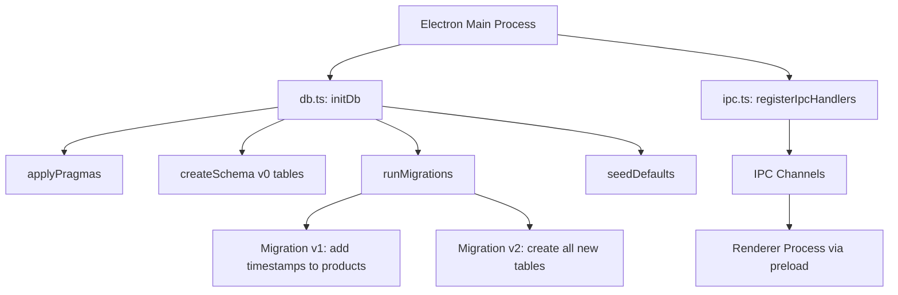
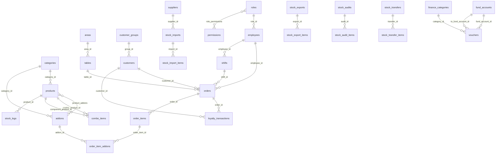

# Design Document: pos-database-schema

## Overview

PosiOrder is a Vietnamese Point-of-Sale desktop application built on Electron + React + better-sqlite3. The current schema covers only three tables (`products`, `orders`, `order_items`). This design delivers a complete, production-ready SQLite schema for all ten application modules.

### Goals

- Extend the existing schema non-destructively via versioned migrations
- Enforce referential integrity with FK constraints and CHECK constraints
- Support soft-delete across all master-data tables
- Store all monetary values as `INTEGER` (VND, no decimals)
- Store all timestamps as `TEXT` in `datetime('now','localtime')` format
- Provide indexes for every common query pattern used by the frontend
- Auto-generate human-readable codes (e.g., `SP00001`, `HD00001`) via triggers

### Non-Goals

- Multi-database or multi-file SQLite setups
- Cloud sync or replication
- Full-text search indexes

---

## Architecture

The schema lives in a single SQLite file at `app.getPath("userData")/posiorder.sqlite`, managed by `electron/db.ts` using better-sqlite3.



### Migration Strategy

Schema versions are tracked with `PRAGMA user_version`. Each migration block is wrapped in a transaction so a failure rolls back completely and leaves `user_version` unchanged.

```
user_version 0 → 1 : Add created_at/updated_at/deleted_at to legacy products table
user_version 1 → 2 : Create all new tables (Requirements 1–9)
```

### Pragma Configuration (applied on every connection open)

| Pragma         | Value       | Reason                                |
| -------------- | ----------- | ------------------------------------- |
| `journal_mode` | `WAL`       | Concurrent reads during writes        |
| `synchronous`  | `NORMAL`    | Safe with WAL, better performance     |
| `foreign_keys` | `ON`        | Enforce FK constraints                |
| `cache_size`   | `-32000`    | 32 MB page cache                      |
| `temp_store`   | `MEMORY`    | Faster temp tables                    |
| `mmap_size`    | `134217728` | 128 MB memory-mapped I/O              |
| `busy_timeout` | `5000`      | Wait 5 s before returning SQLITE_BUSY |

---

## Components and Interfaces

### db.ts Public API

```typescript
// Existing
export function initDb(): Database.Database;
export function getDb(): Database.Database;
export function backupDb(): Promise<void>;
export function listProducts(): Product[];
export function createOrder(payload: CreateOrderPayload): number;

// New helpers (added as needed by IPC handlers)
export function getSettings(): Record<string, string>;
export function upsertSetting(key: string, value: string): void;
```

### Module Groupings

| Module       | Tables                                                                                                                                                                                  |
| ------------ | --------------------------------------------------------------------------------------------------------------------------------------------------------------------------------------- |
| Catalog      | `categories`, `products`, `addons`, `product_addons`, `combo_items`                                                                                                                     |
| Tables/Areas | `areas`, `tables`                                                                                                                                                                       |
| Orders       | `orders`, `order_items`, `order_item_addons`                                                                                                                                            |
| Customers    | `customer_groups`, `customers`, `loyalty_transactions`                                                                                                                                  |
| Employees    | `roles`, `permissions`, `role_permissions`, `employees`                                                                                                                                 |
| Inventory    | `suppliers`, `stock_imports`, `stock_import_items`, `stock_exports`, `stock_export_items`, `stock_audits`, `stock_audit_items`, `stock_transfers`, `stock_transfer_items`, `stock_logs` |
| Finance      | `fund_accounts`, `finance_categories`, `vouchers`                                                                                                                                       |
| Settings     | `settings`                                                                                                                                                                              |
| Shifts       | `shifts`                                                                                                                                                                                |

### Trigger Inventory

| Trigger                    | Table                        | Event        | Action                                              |
| -------------------------- | ---------------------------- | ------------ | --------------------------------------------------- |
| `trg_products_code`        | `products`                   | AFTER INSERT | Set `code = 'SP' \|\| printf('%05d', id)` when NULL |
| `trg_orders_code`          | `orders`                     | AFTER INSERT | Set `code = 'HD' \|\| printf('%05d', id)` when NULL |
| `trg_orders_completed_at`  | `orders`                     | AFTER UPDATE | Set `completed_at` when status → 'completed'        |
| `trg_orders_cancelled_at`  | `orders`                     | AFTER UPDATE | Set `cancelled_at` when status → 'cancelled'        |
| `trg_customers_code`       | `customers`                  | AFTER INSERT | Set `code = 'KH' \|\| printf('%05d', id)` when NULL |
| `trg_employees_code`       | `employees`                  | AFTER INSERT | Set `code = 'NV' \|\| printf('%05d', id)` when NULL |
| `trg_stock_imports_code`   | `stock_imports`              | AFTER INSERT | Set `code = 'NK' \|\| printf('%05d', id)` when NULL |
| `trg_stock_exports_code`   | `stock_exports`              | AFTER INSERT | Set `code = 'XK' \|\| printf('%05d', id)` when NULL |
| `trg_stock_audits_code`    | `stock_audits`               | AFTER INSERT | Set `code = 'KK' \|\| printf('%05d', id)` when NULL |
| `trg_stock_transfers_code` | `stock_transfers`            | AFTER INSERT | Set `code = 'DC' \|\| printf('%05d', id)` when NULL |
| `trg_vouchers_code`        | `vouchers`                   | AFTER INSERT | Set `code` based on direction (PT/PC/PCT) when NULL |
| `trg_settings_updated_at`  | `settings`                   | AFTER UPDATE | Set `updated_at = datetime('now','localtime')`      |
| `trg_*_updated_at`         | all tables with `updated_at` | AFTER UPDATE | Set `updated_at = datetime('now','localtime')`      |

---

## Data Models

### Catalog Module

```sql
CREATE TABLE IF NOT EXISTS categories (
  id         INTEGER PRIMARY KEY AUTOINCREMENT,
  name       TEXT    NOT NULL UNIQUE,
  sort_order INTEGER NOT NULL DEFAULT 0,
  created_at TEXT    NOT NULL DEFAULT (datetime('now','localtime')),
  updated_at TEXT    NOT NULL DEFAULT (datetime('now','localtime')),
  deleted_at TEXT
);

CREATE TABLE IF NOT EXISTS products (
  id          INTEGER PRIMARY KEY AUTOINCREMENT,
  code        TEXT    UNIQUE,
  name        TEXT    NOT NULL,
  barcode     TEXT,
  unit        TEXT    NOT NULL DEFAULT 'cái',
  type        TEXT    NOT NULL DEFAULT 'goods'
                CHECK(type IN ('goods','service','combo','ingredient')),
  cost        INTEGER NOT NULL DEFAULT 0 CHECK(cost >= 0),
  vat         INTEGER NOT NULL DEFAULT 0 CHECK(vat BETWEEN 0 AND 100),
  price       INTEGER NOT NULL CHECK(price >= 0),
  stock       INTEGER NOT NULL DEFAULT 0,
  min_stock   INTEGER NOT NULL DEFAULT 0,
  max_stock   INTEGER,
  category_id INTEGER REFERENCES categories(id) ON DELETE SET NULL,
  is_active   INTEGER NOT NULL DEFAULT 1 CHECK(is_active IN (0,1)),
  is_favorite INTEGER NOT NULL DEFAULT 0 CHECK(is_favorite IN (0,1)),
  image_url   TEXT,
  created_at  TEXT    NOT NULL DEFAULT (datetime('now','localtime')),
  updated_at  TEXT    NOT NULL DEFAULT (datetime('now','localtime')),
  deleted_at  TEXT
);

CREATE TABLE IF NOT EXISTS addons (
  id          INTEGER PRIMARY KEY AUTOINCREMENT,
  name        TEXT    NOT NULL,
  price       INTEGER NOT NULL DEFAULT 0 CHECK(price >= 0),
  category_id INTEGER REFERENCES categories(id) ON DELETE SET NULL,
  created_at  TEXT    NOT NULL DEFAULT (datetime('now','localtime')),
  updated_at  TEXT    NOT NULL DEFAULT (datetime('now','localtime')),
  deleted_at  TEXT
);

CREATE TABLE IF NOT EXISTS product_addons (
  product_id INTEGER NOT NULL REFERENCES products(id) ON DELETE CASCADE,
  addon_id   INTEGER NOT NULL REFERENCES addons(id)   ON DELETE CASCADE,
  PRIMARY KEY (product_id, addon_id)
);

CREATE TABLE IF NOT EXISTS combo_items (
  combo_product_id     INTEGER NOT NULL REFERENCES products(id) ON DELETE CASCADE,
  component_product_id INTEGER NOT NULL REFERENCES products(id) ON DELETE RESTRICT,
  quantity             INTEGER NOT NULL CHECK(quantity > 0),
  PRIMARY KEY (combo_product_id, component_product_id)
);
```

### Tables/Areas Module

```sql
CREATE TABLE IF NOT EXISTS areas (
  id         INTEGER PRIMARY KEY AUTOINCREMENT,
  name       TEXT    NOT NULL UNIQUE,
  sort_order INTEGER NOT NULL DEFAULT 0,
  note       TEXT,
  created_at TEXT    NOT NULL DEFAULT (datetime('now','localtime')),
  updated_at TEXT    NOT NULL DEFAULT (datetime('now','localtime')),
  deleted_at TEXT
);

CREATE TABLE IF NOT EXISTS tables (
  id         INTEGER PRIMARY KEY AUTOINCREMENT,
  name       TEXT    NOT NULL,
  area_id    INTEGER NOT NULL REFERENCES areas(id) ON DELETE RESTRICT,
  capacity   INTEGER NOT NULL DEFAULT 4 CHECK(capacity > 0),
  status     TEXT    NOT NULL DEFAULT 'empty'
               CHECK(status IN ('empty','occupied','ordered')),
  note       TEXT,
  created_at TEXT    NOT NULL DEFAULT (datetime('now','localtime')),
  updated_at TEXT    NOT NULL DEFAULT (datetime('now','localtime')),
  deleted_at TEXT,
  UNIQUE(name, area_id)
);
```

### Orders Module

```sql
-- orders extends the existing table (migration adds new columns)
-- Full definition after migration v2:
CREATE TABLE IF NOT EXISTS orders (
  id               INTEGER PRIMARY KEY AUTOINCREMENT,
  code             TEXT    UNIQUE,
  type             TEXT    NOT NULL DEFAULT 'dine-in'
                     CHECK(type IN ('dine-in','takeaway','delivery')),
  status           TEXT    NOT NULL DEFAULT 'pending'
                     CHECK(status IN ('pending','processing','completed','cancelled','returned')),
  table_id         INTEGER REFERENCES tables(id)    ON DELETE SET NULL,
  customer_id      INTEGER REFERENCES customers(id) ON DELETE SET NULL,
  employee_id      INTEGER REFERENCES employees(id) ON DELETE SET NULL,
  shift_id         INTEGER REFERENCES shifts(id)    ON DELETE SET NULL,
  discount_amount  INTEGER NOT NULL DEFAULT 0 CHECK(discount_amount >= 0),
  promotion_amount INTEGER NOT NULL DEFAULT 0 CHECK(promotion_amount >= 0),
  extra_fee        INTEGER NOT NULL DEFAULT 0 CHECK(extra_fee >= 0),
  subtotal         INTEGER NOT NULL DEFAULT 0 CHECK(subtotal >= 0),
  total            INTEGER NOT NULL CHECK(total >= 0),
  cash_received    INTEGER,
  change_amount    INTEGER,
  payment_method   TEXT    CHECK(payment_method IN ('cash','transfer','card','wallet','point')),
  note             TEXT,
  completed_at     TEXT,
  cancelled_at     TEXT,
  created_at       TEXT    NOT NULL DEFAULT (datetime('now','localtime')),
  updated_at       TEXT    NOT NULL DEFAULT (datetime('now','localtime'))
);

-- order_items extends the existing table (migration adds new columns)
-- Full definition after migration v2:
CREATE TABLE IF NOT EXISTS order_items (
  id              INTEGER PRIMARY KEY AUTOINCREMENT,
  order_id        INTEGER NOT NULL REFERENCES orders(id)   ON DELETE CASCADE,
  product_id      INTEGER NOT NULL REFERENCES products(id) ON DELETE RESTRICT,
  quantity        INTEGER NOT NULL CHECK(quantity > 0),
  unit_price      INTEGER NOT NULL CHECK(unit_price >= 0),
  discount_amount INTEGER NOT NULL DEFAULT 0 CHECK(discount_amount >= 0),
  addon_total     INTEGER NOT NULL DEFAULT 0 CHECK(addon_total >= 0),
  line_total      INTEGER NOT NULL CHECK(line_total >= 0),
  note            TEXT
);

CREATE TABLE IF NOT EXISTS order_item_addons (
  id            INTEGER PRIMARY KEY AUTOINCREMENT,
  order_item_id INTEGER NOT NULL REFERENCES order_items(id) ON DELETE CASCADE,
  addon_id      INTEGER NOT NULL REFERENCES addons(id)      ON DELETE RESTRICT,
  quantity      INTEGER NOT NULL DEFAULT 1 CHECK(quantity > 0),
  unit_price    INTEGER NOT NULL CHECK(unit_price >= 0),
  line_total    INTEGER NOT NULL CHECK(line_total >= 0)
);
```

### Customers Module

```sql
CREATE TABLE IF NOT EXISTS customer_groups (
  id               INTEGER PRIMARY KEY AUTOINCREMENT,
  name             TEXT    NOT NULL UNIQUE,
  point_rate       REAL    NOT NULL DEFAULT 1.0 CHECK(point_rate > 0),
  condition_type   TEXT    CHECK(condition_type IN ('revenue','order_count')),
  condition_value  INTEGER,
  auto_upgrade     INTEGER NOT NULL DEFAULT 0 CHECK(auto_upgrade IN (0,1)),
  note             TEXT,
  created_at       TEXT    NOT NULL DEFAULT (datetime('now','localtime')),
  updated_at       TEXT    NOT NULL DEFAULT (datetime('now','localtime')),
  deleted_at       TEXT
);

CREATE TABLE IF NOT EXISTS customers (
  id             INTEGER PRIMARY KEY AUTOINCREMENT,
  code           TEXT    UNIQUE,
  name           TEXT    NOT NULL,
  phone          TEXT    UNIQUE,
  email          TEXT,
  dob            TEXT,
  address        TEXT,
  group_id       INTEGER REFERENCES customer_groups(id) ON DELETE SET NULL,
  tax_code       TEXT,
  invoice_type   TEXT,
  loyalty_points INTEGER NOT NULL DEFAULT 0 CHECK(loyalty_points >= 0),
  total_revenue  INTEGER NOT NULL DEFAULT 0 CHECK(total_revenue >= 0),
  total_orders   INTEGER NOT NULL DEFAULT 0 CHECK(total_orders >= 0),
  note           TEXT,
  created_at     TEXT    NOT NULL DEFAULT (datetime('now','localtime')),
  updated_at     TEXT    NOT NULL DEFAULT (datetime('now','localtime')),
  deleted_at     TEXT
);

CREATE TABLE IF NOT EXISTS loyalty_transactions (
  id            INTEGER PRIMARY KEY AUTOINCREMENT,
  customer_id   INTEGER NOT NULL REFERENCES customers(id) ON DELETE CASCADE,
  order_id      INTEGER REFERENCES orders(id) ON DELETE SET NULL,
  delta         INTEGER NOT NULL,
  balance_after INTEGER NOT NULL CHECK(balance_after >= 0),
  note          TEXT,
  created_at    TEXT    NOT NULL DEFAULT (datetime('now','localtime'))
);
```

### Employees Module

```sql
CREATE TABLE IF NOT EXISTS roles (
  id          INTEGER PRIMARY KEY AUTOINCREMENT,
  name        TEXT    NOT NULL UNIQUE,
  description TEXT,
  created_at  TEXT    NOT NULL DEFAULT (datetime('now','localtime')),
  updated_at  TEXT    NOT NULL DEFAULT (datetime('now','localtime')),
  deleted_at  TEXT
);

CREATE TABLE IF NOT EXISTS permissions (
  id        INTEGER PRIMARY KEY AUTOINCREMENT,
  group_key TEXT    NOT NULL,
  perm_key  TEXT    NOT NULL,
  label     TEXT    NOT NULL,
  UNIQUE(group_key, perm_key)
);

CREATE TABLE IF NOT EXISTS role_permissions (
  role_id       INTEGER NOT NULL REFERENCES roles(id)       ON DELETE CASCADE,
  permission_id INTEGER NOT NULL REFERENCES permissions(id) ON DELETE CASCADE,
  PRIMARY KEY (role_id, permission_id)
);

CREATE TABLE IF NOT EXISTS employees (
  id         INTEGER PRIMARY KEY AUTOINCREMENT,
  code       TEXT    UNIQUE,
  name       TEXT    NOT NULL,
  phone      TEXT    UNIQUE,
  pin        TEXT,
  role_id    INTEGER REFERENCES roles(id) ON DELETE SET NULL,
  branch     TEXT    NOT NULL DEFAULT 'Main',
  avatar_url TEXT,
  is_active  INTEGER NOT NULL DEFAULT 1 CHECK(is_active IN (0,1)),
  created_at TEXT    NOT NULL DEFAULT (datetime('now','localtime')),
  updated_at TEXT    NOT NULL DEFAULT (datetime('now','localtime')),
  deleted_at TEXT
);
```

### Inventory Module

```sql
CREATE TABLE IF NOT EXISTS suppliers (
  id         INTEGER PRIMARY KEY AUTOINCREMENT,
  code       TEXT    UNIQUE,
  name       TEXT    NOT NULL,
  phone      TEXT,
  email      TEXT,
  address    TEXT,
  note       TEXT,
  created_at TEXT    NOT NULL DEFAULT (datetime('now','localtime')),
  updated_at TEXT    NOT NULL DEFAULT (datetime('now','localtime')),
  deleted_at TEXT
);

CREATE TABLE IF NOT EXISTS stock_imports (
  id           INTEGER PRIMARY KEY AUTOINCREMENT,
  code         TEXT    UNIQUE,
  supplier_id  INTEGER REFERENCES suppliers(id)  ON DELETE SET NULL,
  employee_id  INTEGER REFERENCES employees(id)  ON DELETE SET NULL,
  status       TEXT    NOT NULL DEFAULT 'draft'
                 CHECK(status IN ('draft','confirmed','cancelled')),
  total_cost   INTEGER NOT NULL DEFAULT 0 CHECK(total_cost >= 0),
  note         TEXT,
  confirmed_at TEXT,
  created_at   TEXT    NOT NULL DEFAULT (datetime('now','localtime')),
  updated_at   TEXT    NOT NULL DEFAULT (datetime('now','localtime'))
);

CREATE TABLE IF NOT EXISTS stock_import_items (
  id         INTEGER PRIMARY KEY AUTOINCREMENT,
  import_id  INTEGER NOT NULL REFERENCES stock_imports(id) ON DELETE CASCADE,
  product_id INTEGER NOT NULL REFERENCES products(id)      ON DELETE RESTRICT,
  quantity   INTEGER NOT NULL CHECK(quantity > 0),
  unit_cost  INTEGER NOT NULL CHECK(unit_cost >= 0),
  line_total INTEGER NOT NULL CHECK(line_total >= 0)
);

CREATE TABLE IF NOT EXISTS stock_exports (
  id           INTEGER PRIMARY KEY AUTOINCREMENT,
  code         TEXT    UNIQUE,
  employee_id  INTEGER REFERENCES employees(id) ON DELETE SET NULL,
  reason       TEXT,
  status       TEXT    NOT NULL DEFAULT 'draft'
                 CHECK(status IN ('draft','confirmed','cancelled')),
  note         TEXT,
  confirmed_at TEXT,
  created_at   TEXT    NOT NULL DEFAULT (datetime('now','localtime')),
  updated_at   TEXT    NOT NULL DEFAULT (datetime('now','localtime'))
);

CREATE TABLE IF NOT EXISTS stock_export_items (
  id         INTEGER PRIMARY KEY AUTOINCREMENT,
  export_id  INTEGER NOT NULL REFERENCES stock_exports(id) ON DELETE CASCADE,
  product_id INTEGER NOT NULL REFERENCES products(id)      ON DELETE RESTRICT,
  quantity   INTEGER NOT NULL CHECK(quantity > 0),
  unit_cost  INTEGER NOT NULL CHECK(unit_cost >= 0),
  line_total INTEGER NOT NULL CHECK(line_total >= 0)
);

CREATE TABLE IF NOT EXISTS stock_audits (
  id           INTEGER PRIMARY KEY AUTOINCREMENT,
  code         TEXT    UNIQUE,
  employee_id  INTEGER REFERENCES employees(id) ON DELETE SET NULL,
  status       TEXT    NOT NULL DEFAULT 'draft'
                 CHECK(status IN ('draft','balanced','cancelled')),
  note         TEXT,
  balanced_at  TEXT,
  created_at   TEXT    NOT NULL DEFAULT (datetime('now','localtime')),
  updated_at   TEXT    NOT NULL DEFAULT (datetime('now','localtime'))
);

CREATE TABLE IF NOT EXISTS stock_audit_items (
  id         INTEGER PRIMARY KEY AUTOINCREMENT,
  audit_id   INTEGER NOT NULL REFERENCES stock_audits(id) ON DELETE CASCADE,
  product_id INTEGER NOT NULL REFERENCES products(id)     ON DELETE RESTRICT,
  system_qty INTEGER NOT NULL DEFAULT 0,
  actual_qty INTEGER NOT NULL DEFAULT 0 CHECK(actual_qty >= 0),
  diff_qty   INTEGER GENERATED ALWAYS AS (actual_qty - system_qty) STORED,
  unit_cost  INTEGER NOT NULL DEFAULT 0 CHECK(unit_cost >= 0)
);

CREATE TABLE IF NOT EXISTS stock_transfers (
  id            INTEGER PRIMARY KEY AUTOINCREMENT,
  code          TEXT    UNIQUE,
  from_location TEXT    NOT NULL,
  to_location   TEXT    NOT NULL,
  employee_id   INTEGER REFERENCES employees(id) ON DELETE SET NULL,
  status        TEXT    NOT NULL DEFAULT 'draft'
                  CHECK(status IN ('draft','confirmed','cancelled')),
  note          TEXT,
  confirmed_at  TEXT,
  created_at    TEXT    NOT NULL DEFAULT (datetime('now','localtime')),
  updated_at    TEXT    NOT NULL DEFAULT (datetime('now','localtime'))
);

CREATE TABLE IF NOT EXISTS stock_transfer_items (
  id          INTEGER PRIMARY KEY AUTOINCREMENT,
  transfer_id INTEGER NOT NULL REFERENCES stock_transfers(id) ON DELETE CASCADE,
  product_id  INTEGER NOT NULL REFERENCES products(id)        ON DELETE RESTRICT,
  quantity    INTEGER NOT NULL CHECK(quantity > 0)
);

CREATE TABLE IF NOT EXISTS stock_logs (
  id           INTEGER PRIMARY KEY AUTOINCREMENT,
  product_id   INTEGER NOT NULL REFERENCES products(id) ON DELETE CASCADE,
  delta        INTEGER NOT NULL,
  balance_after INTEGER NOT NULL,
  source_type  TEXT    NOT NULL
                 CHECK(source_type IN ('import','export','audit','transfer','sale','manual')),
  source_id    INTEGER,
  note         TEXT,
  created_at   TEXT    NOT NULL DEFAULT (datetime('now','localtime'))
);
```

### Finance Module

```sql
CREATE TABLE IF NOT EXISTS fund_accounts (
  id         INTEGER PRIMARY KEY AUTOINCREMENT,
  name       TEXT    NOT NULL UNIQUE,
  type       TEXT    NOT NULL CHECK(type IN ('cash','bank','wallet')),
  balance    INTEGER NOT NULL DEFAULT 0,
  is_active  INTEGER NOT NULL DEFAULT 1 CHECK(is_active IN (0,1)),
  created_at TEXT    NOT NULL DEFAULT (datetime('now','localtime')),
  updated_at TEXT    NOT NULL DEFAULT (datetime('now','localtime')),
  deleted_at TEXT
);

CREATE TABLE IF NOT EXISTS finance_categories (
  id         INTEGER PRIMARY KEY AUTOINCREMENT,
  name       TEXT    NOT NULL,
  direction  TEXT    NOT NULL CHECK(direction IN ('income','expense')),
  note       TEXT,
  created_at TEXT    NOT NULL DEFAULT (datetime('now','localtime')),
  updated_at TEXT    NOT NULL DEFAULT (datetime('now','localtime')),
  deleted_at TEXT,
  UNIQUE(name, direction)
);

CREATE TABLE IF NOT EXISTS vouchers (
  id                 INTEGER PRIMARY KEY AUTOINCREMENT,
  code               TEXT    UNIQUE,
  direction          TEXT    NOT NULL CHECK(direction IN ('income','expense','transfer')),
  category_id        INTEGER REFERENCES finance_categories(id) ON DELETE SET NULL,
  fund_account_id    INTEGER NOT NULL REFERENCES fund_accounts(id) ON DELETE RESTRICT,
  to_fund_account_id INTEGER REFERENCES fund_accounts(id) ON DELETE RESTRICT,
  amount             INTEGER NOT NULL CHECK(amount > 0),
  person_name        TEXT,
  employee_id        INTEGER REFERENCES employees(id) ON DELETE SET NULL,
  accounting         INTEGER NOT NULL DEFAULT 1 CHECK(accounting IN (0,1)),
  note               TEXT,
  voucher_at         TEXT    NOT NULL DEFAULT (datetime('now','localtime')),
  created_at         TEXT    NOT NULL DEFAULT (datetime('now','localtime')),
  updated_at         TEXT    NOT NULL DEFAULT (datetime('now','localtime')),
  CHECK(direction != 'transfer' OR to_fund_account_id IS NOT NULL)
);
```

### Settings Module

```sql
CREATE TABLE IF NOT EXISTS settings (
  key        TEXT PRIMARY KEY,
  value      TEXT NOT NULL,
  updated_at TEXT NOT NULL DEFAULT (datetime('now','localtime'))
);
```

### Shifts Module

```sql
CREATE TABLE IF NOT EXISTS shifts (
  id           INTEGER PRIMARY KEY AUTOINCREMENT,
  employee_id  INTEGER REFERENCES employees(id) ON DELETE SET NULL,
  opened_at    TEXT    NOT NULL DEFAULT (datetime('now','localtime')),
  closed_at    TEXT,
  opening_cash INTEGER NOT NULL DEFAULT 0 CHECK(opening_cash >= 0),
  closing_cash INTEGER,
  note         TEXT,
  status       TEXT    NOT NULL DEFAULT 'open' CHECK(status IN ('open','closed'))
);
```

### Index Definitions

```sql
-- Catalog
CREATE INDEX IF NOT EXISTS idx_products_category  ON products(category_id) WHERE deleted_at IS NULL;
CREATE INDEX IF NOT EXISTS idx_products_active     ON products(is_active)   WHERE deleted_at IS NULL;
CREATE INDEX IF NOT EXISTS idx_products_barcode    ON products(barcode)     WHERE barcode IS NOT NULL;

-- Tables/Areas
CREATE INDEX IF NOT EXISTS idx_tables_area         ON tables(area_id) WHERE deleted_at IS NULL;

-- Orders
CREATE INDEX IF NOT EXISTS idx_orders_status       ON orders(status);
CREATE INDEX IF NOT EXISTS idx_orders_table        ON orders(table_id)    WHERE table_id IS NOT NULL;
CREATE INDEX IF NOT EXISTS idx_orders_customer     ON orders(customer_id) WHERE customer_id IS NOT NULL;
CREATE INDEX IF NOT EXISTS idx_orders_employee     ON orders(employee_id) WHERE employee_id IS NOT NULL;
CREATE INDEX IF NOT EXISTS idx_orders_createdat    ON orders(created_at DESC);
CREATE INDEX IF NOT EXISTS idx_orderitems_orderid  ON order_items(order_id);

-- Customers
CREATE INDEX IF NOT EXISTS idx_customers_phone     ON customers(phone)    WHERE deleted_at IS NULL;
CREATE INDEX IF NOT EXISTS idx_customers_group     ON customers(group_id) WHERE deleted_at IS NULL;

-- Employees
CREATE INDEX IF NOT EXISTS idx_employees_role      ON employees(role_id) WHERE deleted_at IS NULL;
CREATE INDEX IF NOT EXISTS idx_employees_phone     ON employees(phone)   WHERE deleted_at IS NULL;

-- Inventory
CREATE INDEX IF NOT EXISTS idx_stocklogs_product   ON stock_logs(product_id, created_at DESC);
CREATE INDEX IF NOT EXISTS idx_stocklogs_source    ON stock_logs(source_type, source_id);
CREATE INDEX IF NOT EXISTS idx_stockimports_supplier ON stock_imports(supplier_id);
CREATE INDEX IF NOT EXISTS idx_stockimports_status ON stock_imports(status);

-- Finance
CREATE INDEX IF NOT EXISTS idx_vouchers_direction  ON vouchers(direction);
CREATE INDEX IF NOT EXISTS idx_vouchers_fund       ON vouchers(fund_account_id);
CREATE INDEX IF NOT EXISTS idx_vouchers_voucherat  ON vouchers(voucher_at DESC);
CREATE INDEX IF NOT EXISTS idx_vouchers_employee   ON vouchers(employee_id);

-- Shifts
CREATE INDEX IF NOT EXISTS idx_shifts_employee     ON shifts(employee_id, opened_at DESC);
```

### Entity Relationship Diagram



---

## Correctness Properties

_A property is a characteristic or behavior that should hold true across all valid executions of a system — essentially, a formal statement about what the system should do. Properties serve as the bridge between human-readable specifications and machine-verifiable correctness guarantees._

**Property Reflection:** After reviewing all prework items, the following consolidations were made:

- Code-generation trigger properties (1.8, 3.5, 4.3, 5.5, 6.12, 7.4) share the same pattern and are consolidated into one property.
- The `updated_at` trigger property (10.10) covers all tables uniformly and is stated once.
- The `completed_at` and `cancelled_at` trigger properties (3.6, 3.7) are combined into one status-timestamp property.
- Soft-delete preservation (1.3, 10.9) is stated as one universal property.
- CHECK constraint rejection properties (1.2, 2.2, 3.1, 4.2, 4.5) are consolidated into one property about constraint enforcement.

---

### Property 1: CHECK constraints reject invalid rows

_For any_ table in the schema that defines a CHECK constraint (e.g., `price >= 0`, `type IN (...)`, `vat BETWEEN 0 AND 100`, `loyalty_points >= 0`, `balance_after >= 0`), attempting to insert or update a row that violates any CHECK constraint SHALL cause the DB to reject the operation with a constraint error, leaving the table unchanged.

**Validates: Requirements 1.2, 2.2, 3.1, 4.2, 4.5, 7.3**

---

### Property 2: Composite UNIQUE constraints prevent duplicates

_For any_ table with a composite UNIQUE constraint (`tables(name, area_id)`, `permissions(group_key, perm_key)`, `finance_categories(name, direction)`, `product_addons(product_id, addon_id)`, `combo_items(combo_product_id, component_product_id)`, `role_permissions(role_id, permission_id)`), inserting a second row with the same key values SHALL fail with a UNIQUE constraint error.

**Validates: Requirements 1.5, 2.3, 5.2, 7.2**

---

### Property 3: Auto-generated codes follow prefix + zero-padded id format

_For any_ row inserted into `products`, `orders`, `customers`, `employees`, `stock_imports`, `stock_exports`, `stock_audits`, `stock_transfers`, or `vouchers` with `code = NULL`, the trigger SHALL set `code` to the correct prefix (`SP`, `HD`, `KH`, `NV`, `NK`, `XK`, `KK`, `DC`, or `PT`/`PC`/`PCT` for vouchers) concatenated with the row's `id` zero-padded to 5 digits. For any row inserted with a non-NULL `code`, the trigger SHALL leave `code` unchanged.

**Validates: Requirements 1.8, 3.5, 4.3, 5.5, 6.12, 7.4**

---

### Property 4: Status transitions record timestamps

_For any_ order row, when `status` is updated to `'completed'`, `completed_at` SHALL be set to a non-null, valid `datetime('now','localtime')` string. When `status` is updated to `'cancelled'`, `cancelled_at` SHALL be set to a non-null, valid datetime string. For any other status transition, neither `completed_at` nor `cancelled_at` SHALL be modified by the trigger.

**Validates: Requirements 3.6, 3.7**

---

### Property 5: Soft-delete preserves rows

_For any_ row in a soft-deletable table (`categories`, `products`, `addons`, `areas`, `tables`, `customers`, `customer_groups`, `employees`, `roles`, `suppliers`, `fund_accounts`, `finance_categories`), setting `deleted_at` to a non-null timestamp SHALL keep the row physically present in the table. The row SHALL be retrievable by its primary key. No cascade deletion SHALL occur on child rows as a result of a soft-delete.

**Validates: Requirements 1.3, 10.9**

---

### Property 6: updated_at is refreshed on every UPDATE

_For any_ row in any table that has an `updated_at` column, after any UPDATE operation on that row, the `updated_at` value SHALL be greater than or equal to its previous value and SHALL be a valid `datetime('now','localtime')` string.

**Validates: Requirements 8.3, 10.10**

---

### Property 7: stock_audit_items diff_qty is always actual_qty minus system_qty

_For any_ `stock_audit_items` row with any combination of `actual_qty` and `system_qty` values, the generated column `diff_qty` SHALL always equal `actual_qty - system_qty`.

**Validates: Requirements 6.7**

---

### Property 8: Transfer vouchers require a destination fund account

_For any_ voucher row with `direction = 'transfer'`, the DB SHALL reject the insert if `to_fund_account_id IS NULL`. _For any_ voucher row with `direction` in `('income', 'expense')`, the DB SHALL accept the insert regardless of whether `to_fund_account_id` is NULL or not.

**Validates: Requirements 7.3, 7.6**

---

### Property 9: Migrations are idempotent and version-monotonic

_For any_ starting `user_version` value between 0 and the latest version, running `initDb()` SHALL result in `user_version` equaling the latest version, with all expected tables and indexes present. Running `initDb()` a second time on an already-migrated DB SHALL leave `user_version` and all table structures unchanged.

**Validates: Requirements 10.2, 10.3**

---

## Error Handling

### Constraint Violations

All SQLite constraint errors (UNIQUE, CHECK, FK, NOT NULL) propagate as exceptions from better-sqlite3. The IPC layer in `ipc.ts` must catch these and return structured error responses to the renderer.

```typescript
try {
  return { ok: true, data: db.prepare(...).run(...) };
} catch (err) {
  if (err instanceof Error && err.message.includes('UNIQUE')) {
    return { ok: false, code: 'DUPLICATE', message: err.message };
  }
  return { ok: false, code: 'DB_ERROR', message: String(err) };
}
```

### Migration Failures

Each migration block is wrapped in a transaction. If any statement throws, the transaction rolls back and `user_version` remains at its previous value. The error is re-thrown so `initDb()` fails fast and the app shows an error dialog rather than starting with a partially migrated DB.

```typescript
const migrate = db.transaction(() => {
  db.exec(migrationSql);
  db.pragma(`user_version = ${targetVersion}`);
});
try {
  migrate();
} catch (err) {
  // user_version unchanged, DB consistent
  throw new Error(`Migration to v${targetVersion} failed: ${err}`);
}
```

### FK Violations

With `PRAGMA foreign_keys = ON`, inserting a child row referencing a non-existent parent throws `SQLITE_CONSTRAINT_FOREIGNKEY`. Deleting a parent row that has `ON DELETE RESTRICT` children also throws. These must be caught and surfaced as user-friendly messages (e.g., "Cannot delete category: products still reference it").

### Busy Timeout

With `PRAGMA busy_timeout = 5000`, concurrent IPC calls that hit a locked DB will wait up to 5 seconds before throwing `SQLITE_BUSY`. The IPC handler should surface this as a retryable error.

---

## Testing Strategy

### Dual Testing Approach

Both unit/example tests and property-based tests are used:

- **Unit/example tests**: Verify specific scenarios, seeding behavior, migration paths, and error conditions
- **Property-based tests**: Verify universal invariants across randomly generated inputs

### Property-Based Testing Library

Use **[fast-check](https://github.com/dubzzz/fast-check)** for TypeScript/Node.js property-based testing. Each property test runs a minimum of **100 iterations**.

Tag format for each property test:

```
// Feature: pos-database-schema, Property N: <property_text>
```

### Property Test Implementations

| Property                        | Test Description                                                                 | Arbitraries                                                 |
| ------------------------------- | -------------------------------------------------------------------------------- | ----------------------------------------------------------- |
| P1: CHECK constraints           | Generate rows with random invalid values for each constrained column             | `fc.integer()`, `fc.string()` with out-of-range values      |
| P2: UNIQUE constraints          | Generate pairs of rows with identical composite keys                             | `fc.tuple(fc.string(), fc.string())`                        |
| P3: Auto-generated codes        | Insert N rows with NULL code, verify each code matches pattern                   | `fc.array(fc.record({...}), {minLength: 1, maxLength: 50})` |
| P4: Status timestamps           | Generate orders, update to completed/cancelled, verify timestamps                | `fc.constantFrom('completed','cancelled')`                  |
| P5: Soft-delete preservation    | Generate rows, soft-delete, verify physical presence                             | `fc.record({...})` for each soft-deletable table            |
| P6: updated_at refresh          | Generate rows, perform updates, verify updated_at >= previous                    | `fc.record({...})` with `fc.string()` values                |
| P7: diff_qty invariant          | Generate (system_qty, actual_qty) pairs, verify diff_qty                         | `fc.tuple(fc.integer(), fc.nat())`                          |
| P8: Transfer voucher constraint | Generate vouchers with direction='transfer' and NULL/non-NULL to_fund_account_id | `fc.constantFrom('income','expense','transfer')`            |
| P9: Migration idempotency       | Run initDb() on fresh DB, run again, verify user_version stable                  | In-memory SQLite DB                                         |

### Unit/Example Tests

- **Schema smoke tests**: Verify all 30+ tables and all indexes exist after `initDb()`
- **Settings seeding**: Verify all 22 default settings keys are present after first init
- **Migration path**: Verify v0→v1→v2 migration sequence produces correct schema
- **Migration rollback**: Inject a SQL error mid-migration, verify user_version unchanged
- **FK cascade**: Verify `ON DELETE CASCADE` removes child rows when parent is deleted
- **FK restrict**: Verify `ON DELETE RESTRICT` blocks parent deletion when children exist
- **FK set-null**: Verify `ON DELETE SET NULL` nullifies FK column when parent is deleted

### Test Infrastructure

Tests run against an **in-memory SQLite database** (`new Database(':memory:')`) to avoid file I/O and ensure isolation between test runs. Each test creates a fresh DB instance.

```typescript
import Database from "better-sqlite3";
import { createSchema, runMigrations, applyPragmas } from "../electron/db";

function createTestDb(): Database.Database {
  const db = new Database(":memory:");
  applyPragmas(db);
  createSchema(db);
  runMigrations(db);
  return db;
}
```
